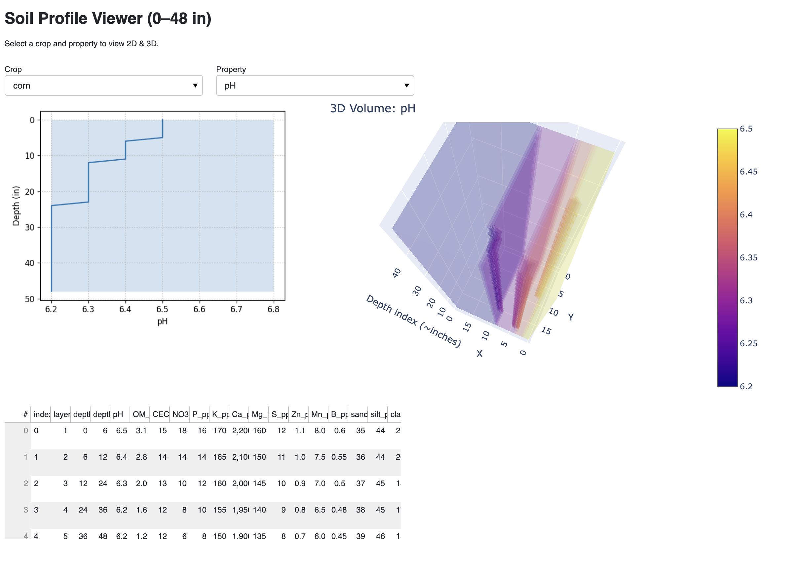

# Soil Profile 2D/3D Viewer (Dent Corn & Alfalfa)

An example Python app to load **layered 0–48 inch soil profiles** (with macros, micros, texture, pH)
and visualize them in **2D** (matplotlib depth profiles with ideal bands) and **3D** (Plotly volume).





## Contents

- `app.py` — Panel app with a crop selector and property selector; shows 2D depth profile + 3D volume.
- `data/corn.json` — Sample dent corn dataset with **ideal_targets** and **sample_profile_layers**.
- `data/alfalfa.json` — Sample alfalfa dataset with **ideal_targets** and **sample_profile_layers**.
- `requirements.txt` — Minimal dependencies.
- This `README.md`.

> Notes: Targets and values are **illustrative** and should be replaced with your local agronomic guidelines.

## Quickstart

```bash
python3 -m venv .venv
source .venv/bin/activate   # Windows: .venv\Scripts\activate
pip3 install -r requirements.txt
```

### Run the app

```bash
python3 app.py
# or with Panel explicitly (optional)
panel serve app.py --show --port 5006
```

Then open your browser to the URL displayed (defaults to http://localhost:5006).

## Data format

Each JSON file contains:
- `crop`: name
- `ideal_targets`: dict of property -> {min, max}
- `texture_targets_pct`: target texture percent
- `bacteria_targets`: list of beneficial genera (illustrative)
- `sample_profile_layers`: **list of layer dicts** with keys:
  - `layer_id`, `depth_top_in`, `depth_bottom_in`
  - `pH`, `OM_pct`, `CEC_cmolc_kg`
  - Macro/micro nutrients (e.g., `NO3_N_ppm`, `P_ppm_Olsen`, `K_ppm`, `Ca_ppm`, `Mg_ppm`, `S_ppm`, `Zn_ppm`, `Mn_ppm`, `B_ppm`)
  - Texture (`sand_pct`, `silt_pct`, `clay_pct`)

## Customize

- Add your own layers to `data/*.json`.
- Add more properties to `PLOT_PROPS` in `app.py`.
- Replace ideal target bands in the JSON to match your region & lab method (e.g., Olsen vs Bray).

## 3D notes

The demo builds a simple rectangular volume by **replicating each depth's scalar across X and Y**. If you have spatial grids,
replace `make_volume` with your `nx, ny` raster per depth for a true 3D block model.

## License

MIT (example code).

